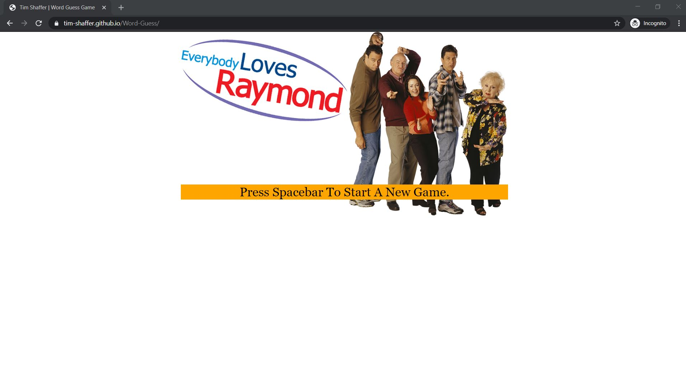
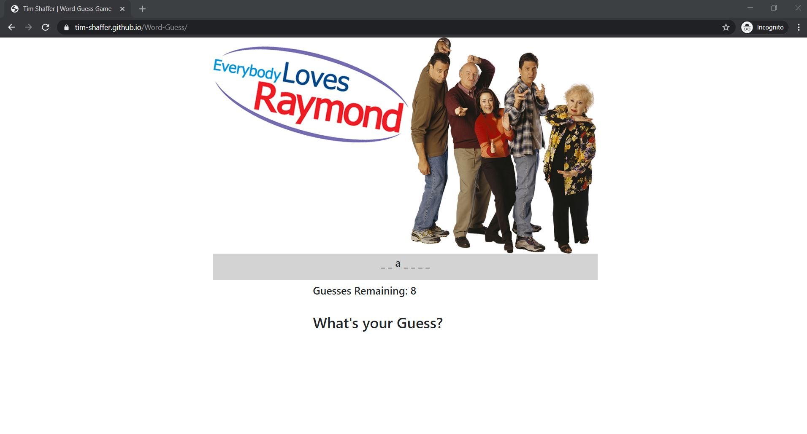
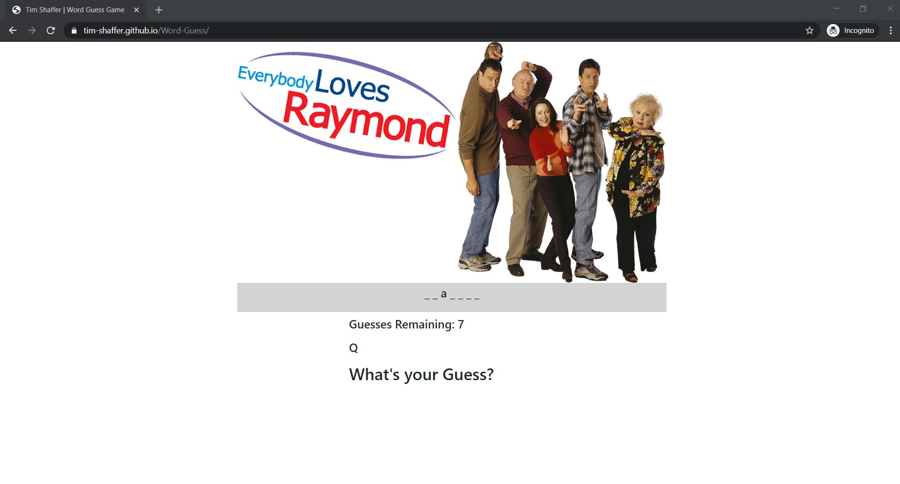
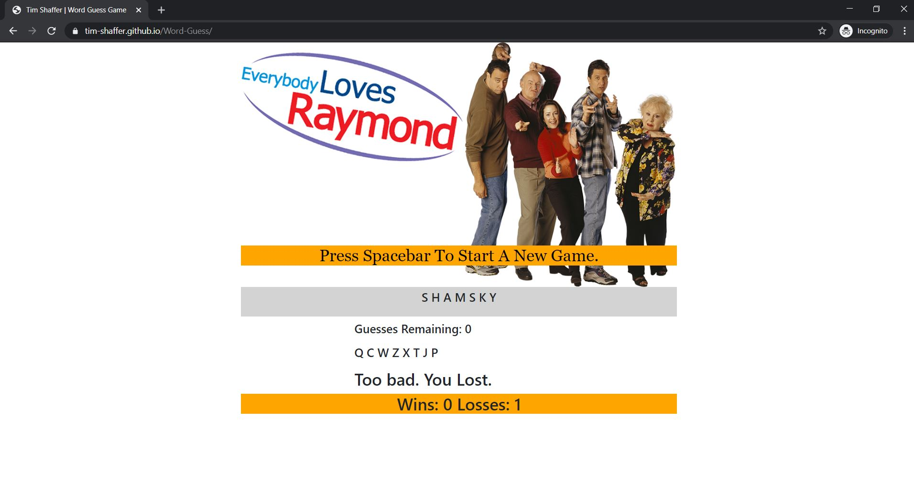
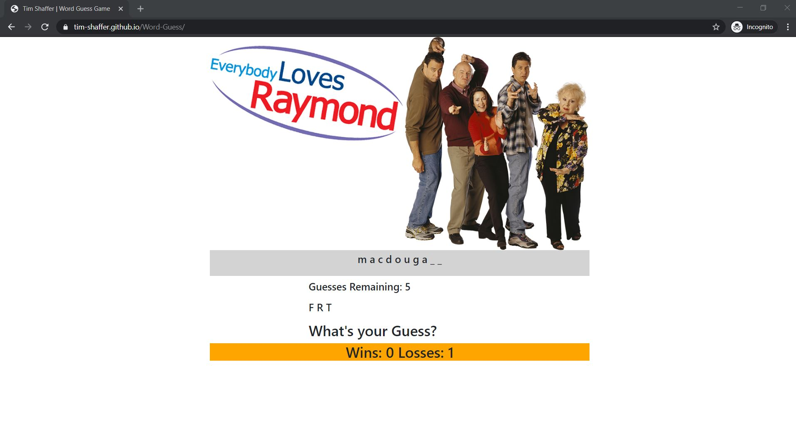
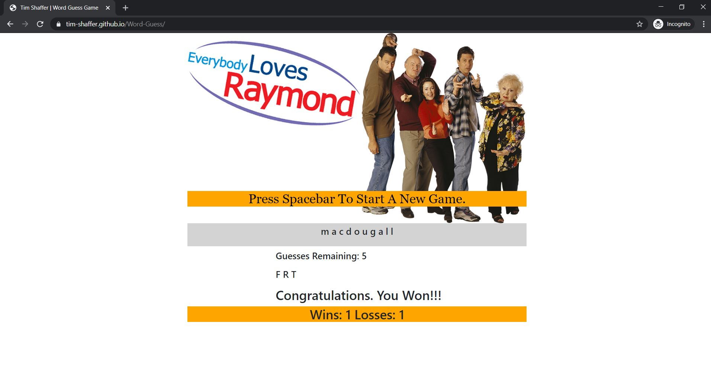

# Word-Guess
Word Guess Game

* Link directly to the page here: https://tim-shaffer.github.io/Word-Guess/

The Word Guess game was built with an **"Everybody Loves Raymond"** theme.

The object of the game is to guess the word associated with the popular show by selecting one letter at a time. 

The game starts with an image of the major characters in the show at the top with the *theme* playing in the background. 
Pressing the Spacebar will cause the programming to randomly select a word from a hard coded list that fans of the show should recognize.

After the hidden word is displayed, the user will guess letters to see if he/she can figure out the word.  If the letter is found in the hidden word, the letter will be revealed in all the positions that it is found.  If the letter is **NOT** found in the hidden word, the letter will show in a separate list and the number of remaining guesses will be reduced by one.  

The game continues until the word is revealed or there are no guesses remaining.  When the word is guessed, a **WIN** is tallied.  When the word is *not* guessed in the number of tries allowed, a **loss** is tallied and the word revealed in **CAPS**.  Each win or loss is notified by a separate sound playing.  **Wins** are notified with a clip of Robert Barone saying the famous **"Everybody Loves Raymond"** line.  A **Loss** is notified with a clip of Raymond Barone saying **"No, No, No ... No"**. 

Since the words to be guessed are selected randomly from a provided list, it is possible to get the same word more than once while playing the game.

### Game Play

1. Visit the page to start:  https://tim-shaffer.github.io/Word-Guess/
1. The Main Screen will be displayed where you will need to "Press the Spacebar to Start A New Game"

    

1. With the release of the Spacebar, a new word to guess is determined and presented with each `_` representing a letter in the word to be guessed.

	

1. In this case, the word has 7 letters.  Simply press a letter key to guess that letter.  Matches will show in the correct position.

    

1. Correct Guesses do **NOT** count against you, but you only get 8 incorrect guesses.

    

1. Continue to Guess the letters in the word 

    

1. If you run out of guesses, the game is considered a loss.  The word will be displayed in all **CAPS** and the loss total incremented.

    

1. Press the Spacebar to get a New Word. The Total Wins and Losses is kept. Continue playing with the new word in the same manner as before.

    

1. Successfully guessing all the letters in the word before running out of guesses will count as a win.  All the letters will be filled in by your guesses in the display and the win total incremented.

    

1. Continue to play as much as you would like!!!

